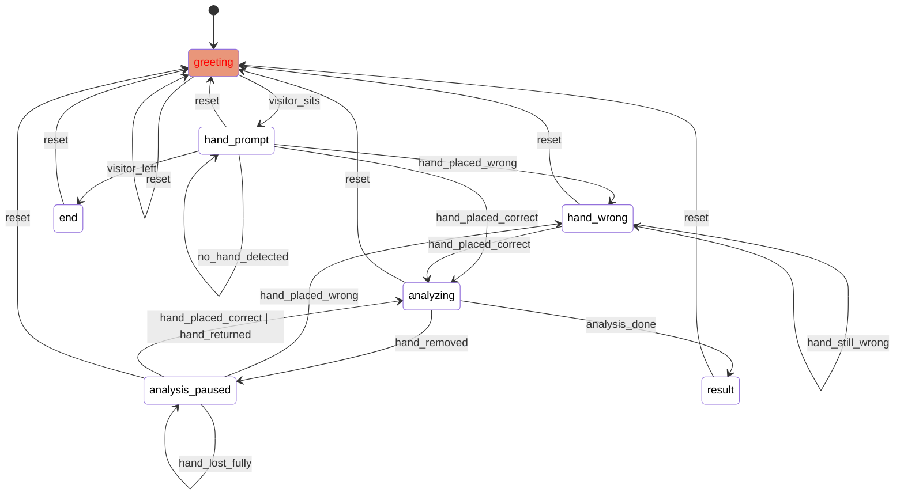

```mermaid
---
The Witch State Machine
---
stateDiagram-v2
  direction TB
  classDef s_default fill:white,color:black
  classDef s_inactive fill:white,color:black
  classDef s_parallel color:black,fill:white
  classDef s_active color:red,fill:darksalmon
  classDef s_previous color:blue,fill:azure
  
  state "greeting" as greeting
  Class greeting s_active
  state "hand_prompt" as hand_prompt
  Class hand_prompt s_default
  state "hand_wrong" as hand_wrong
  Class hand_wrong s_default
  state "analyzing" as analyzing
  Class analyzing s_default
  state "analysis_paused" as analysis_paused
  Class analysis_paused s_default
  state "result" as result
  Class result s_default
  state "end" as end
  Class end s_default
  
  greeting --> hand_prompt: visitor_sits
  greeting --> greeting: reset
  hand_prompt --> hand_wrong: hand_placed_wrong
  hand_prompt --> analyzing: hand_placed_correct
  hand_prompt --> hand_prompt: no_hand_detected
  hand_prompt --> end: visitor_left
  hand_prompt --> greeting: reset
  analysis_paused --> hand_wrong: hand_placed_wrong
  analysis_paused --> analyzing: hand_placed_correct | hand_returned
  analysis_paused --> analysis_paused: hand_lost_fully
  analysis_paused --> greeting: reset
  hand_wrong --> analyzing: hand_placed_correct
  hand_wrong --> hand_wrong: hand_still_wrong
  hand_wrong --> greeting: reset
  analyzing --> analysis_paused: hand_removed
  analyzing --> result: analysis_done
  analyzing --> greeting: reset
  result --> greeting: reset
  end --> greeting: reset
  [*] --> greeting
```
