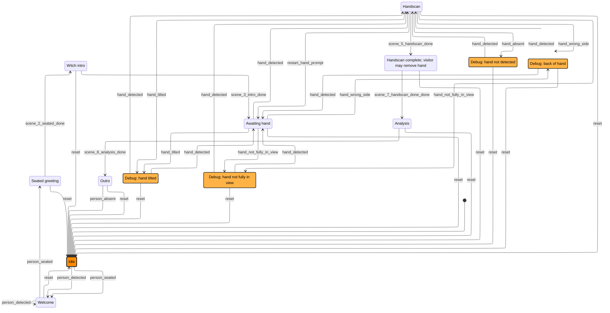

```mermaid
---
config:
  layout: elk
---
stateDiagram-v2
  direction TB
  [*] --> scene_0_idle

  %% Main flow
  state "Idle" as scene_0_idle
  state "Welcome" as scene_1_welcome
  state "Seated greeting" as scene_2_seated
  state "Witch intro" as scene_3_intro
  state "Awaiting hand" as scene_4_awaiting_hand
  state "Handscan" as scene_5_handscan
  state "Handscan complete; visitor may remove hand" as scene_7_handscan_done
  state "Analysis" as scene_8_analysis
  state "Outro" as scene_9_outro
  state "Debug: hand not detected" as scene_debug_shot_1_hand_absent
  state "Debug: hand tilted" as scene_debug_shot_2_hand_tilted
  state "Debug: back of hand" as scene_debug_shot_3_hand_wrong_side
  state "Debug: hand not fully in view" as scene_debug_shot_4_hand_not_fully_in_view

  %% Normal flow transitions
  scene_0_idle --> scene_1_welcome: person_detected
  scene_0_idle --> scene_1_welcome: person_seated
  scene_1_welcome --> scene_1_welcome: person_detected
  scene_1_welcome --> scene_2_seated: person_seated
  scene_2_seated --> scene_3_intro: scene_2_seated_done
  scene_3_intro --> scene_4_awaiting_hand: scene_3_intro_done
  scene_4_awaiting_hand --> scene_5_handscan: hand_detected
  scene_4_awaiting_hand --> scene_debug_shot_4_hand_not_fully_in_view: hand_not_fully_in_view
  scene_4_awaiting_hand --> scene_debug_shot_2_hand_tilted: hand_tilted
  scene_4_awaiting_hand --> scene_debug_shot_3_hand_wrong_side: hand_wrong_side
  scene_5_handscan --> scene_debug_shot_1_hand_absent: hand_absent
  scene_5_handscan --> scene_debug_shot_4_hand_not_fully_in_view: hand_not_fully_in_view
  scene_5_handscan --> scene_debug_shot_2_hand_tilted: hand_tilted
  scene_5_handscan --> scene_debug_shot_3_hand_wrong_side: hand_wrong_side
  scene_5_handscan --> scene_4_awaiting_hand: restart_hand_prompt
  scene_5_handscan --> scene_7_handscan_done: scene_5_handscan_done
  scene_7_handscan_done --> scene_8_analysis: scene_7_handscan_done_done
  scene_8_analysis --> scene_9_outro: scene_8_analysis_done
  scene_9_outro --> scene_0_idle: person_absent

  %% Debug state transitions (with hand_detected returning to source)
  scene_debug_shot_4_hand_not_fully_in_view --> scene_4_awaiting_hand: hand_detected
  scene_debug_shot_2_hand_tilted --> scene_4_awaiting_hand: hand_detected
  scene_debug_shot_3_hand_wrong_side --> scene_4_awaiting_hand: hand_detected
  scene_debug_shot_1_hand_absent --> scene_5_handscan: hand_detected
  scene_debug_shot_4_hand_not_fully_in_view --> scene_5_handscan: hand_detected
  scene_debug_shot_2_hand_tilted --> scene_5_handscan: hand_detected
  scene_debug_shot_3_hand_wrong_side --> scene_5_handscan: hand_detected

  %% Reset transitions
  scene_1_welcome --> scene_0_idle: reset
  scene_2_seated --> scene_0_idle: reset
  scene_3_intro --> scene_0_idle: reset
  scene_4_awaiting_hand --> scene_0_idle: reset
  scene_5_handscan --> scene_0_idle: reset
  scene_7_handscan_done --> scene_0_idle: reset
  scene_8_analysis --> scene_0_idle: reset
  scene_9_outro --> scene_0_idle: reset
  scene_debug_shot_1_hand_absent --> scene_0_idle: reset
  scene_debug_shot_2_hand_tilted --> scene_0_idle: reset
  scene_debug_shot_3_hand_wrong_side --> scene_0_idle: reset
  scene_debug_shot_4_hand_not_fully_in_view --> scene_0_idle: reset

  classDef current fill:#ff8c00,stroke:#222,stroke-width:3px,color:#000
  classDef debug fill:#ffb347,stroke:#222,stroke-width:2px,color:#000
  classDef mainFlow fill:#90ee90,stroke:#222,stroke-width:2px,color:#000
  class scene_debug_shot_1_hand_absent debug
  class scene_debug_shot_2_hand_tilted debug
  class scene_debug_shot_3_hand_wrong_side debug
  class scene_debug_shot_4_hand_not_fully_in_view debug
  class scene_0_idle current
```
