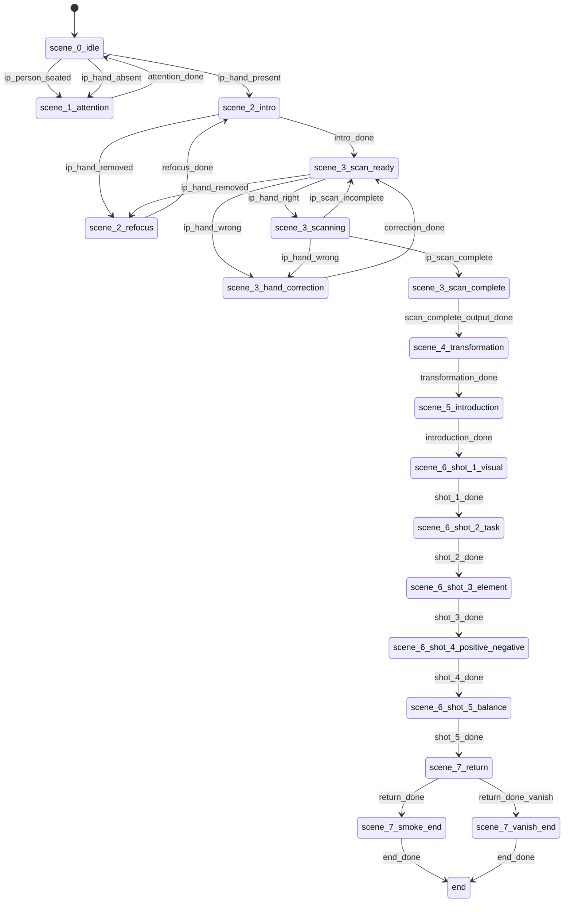

```mermaid
stateDiagram-v2
direction TB
    [*] --> scene_0_idle
    scene_0_idle --> scene_1_attention: ip_person_seated
    scene_0_idle --> scene_1_attention: ip_hand_absent
    scene_1_attention --> scene_0_idle: attention_done
    scene_0_idle --> scene_2_intro: ip_hand_present
    scene_2_intro --> scene_3_scan_ready: intro_done
    scene_2_intro --> scene_2_refocus: ip_hand_removed
    scene_2_refocus --> scene_2_intro: refocus_done
    scene_3_scan_ready --> scene_2_refocus: ip_hand_removed
    scene_3_scan_ready --> scene_3_hand_correction: ip_hand_wrong
    scene_3_hand_correction --> scene_3_scan_ready: correction_done
    scene_3_scan_ready --> scene_3_scanning: ip_hand_right
    scene_3_scanning --> scene_3_hand_correction: ip_hand_wrong
    scene_3_scanning --> scene_3_scan_ready: ip_scan_incomplete
    scene_3_scanning --> scene_3_scan_complete: ip_scan_complete
    scene_3_scan_complete --> scene_4_transformation: scan_complete_output_done
    scene_4_transformation --> scene_5_introduction: transformation_done
    scene_5_introduction --> scene_6_shot_1_visual: introduction_done
    scene_6_shot_1_visual --> scene_6_shot_2_task: shot_1_done
    scene_6_shot_2_task --> scene_6_shot_3_element: shot_2_done
    scene_6_shot_3_element --> scene_6_shot_4_positive_negative: shot_3_done
    scene_6_shot_4_positive_negative --> scene_6_shot_5_balance: shot_4_done
    scene_6_shot_5_balance --> scene_7_return: shot_5_done
    scene_7_return --> scene_7_smoke_end: return_done
    scene_7_return --> scene_7_vanish_end: return_done_vanish
    scene_7_smoke_end --> end: end_done
    scene_7_vanish_end --> end: end_done
```
