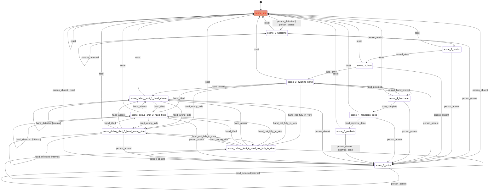

```mermaid
---
The Witch State Machine
---
stateDiagram-v2
  direction TB
  classDef s_default fill:white,color:black
  classDef s_inactive fill:white,color:black
  classDef s_parallel color:black,fill:white
  classDef s_active color:red,fill:darksalmon
  classDef s_previous color:blue,fill:azure

  state "scene_idle" as scene_idle
  Class scene_idle s_active
  state "scene_0_welcome" as scene_0_welcome
  Class scene_0_welcome s_default
  state "scene_1_seated" as scene_1_seated
  Class scene_1_seated s_default
  state "scene_2_intro" as scene_2_intro
  Class scene_2_intro s_default
  state "scene_3_awaiting_hand" as scene_3_awaiting_hand
  Class scene_3_awaiting_hand s_default
  state "scene_4_handscan" as scene_4_handscan
  Class scene_4_handscan s_default
  state "scene_4_handscan_done" as scene_4_handscan_done
  Class scene_4_handscan_done s_default
  state "scene_5_analysis" as scene_5_analysis
  Class scene_5_analysis s_default
  state "scene_6_outro" as scene_6_outro
  Class scene_6_outro s_default
  state "scene_debug_shot_1_hand_absent" as scene_debug_shot_1_hand_absent
  Class scene_debug_shot_1_hand_absent s_default
  state "scene_debug_shot_2_hand_tilted" as scene_debug_shot_2_hand_tilted
  Class scene_debug_shot_2_hand_tilted s_default
  state "scene_debug_shot_3_hand_wrong_side" as scene_debug_shot_3_hand_wrong_side
  Class scene_debug_shot_3_hand_wrong_side s_default
  state "scene_debug_shot_4_hand_not_fully_in_view" as scene_debug_shot_4_hand_not_fully_in_view
  Class scene_debug_shot_4_hand_not_fully_in_view s_default

  scene_idle --> scene_0_welcome: person_detected | person_seated
  scene_idle --> scene_6_outro: person_absent
  scene_idle --> scene_idle: reset
  scene_0_welcome --> scene_0_welcome: person_detected
  scene_0_welcome --> scene_1_seated: person_seated
  scene_0_welcome --> scene_6_outro: person_absent
  scene_0_welcome --> scene_idle: reset
  scene_1_seated --> scene_6_outro: person_absent
  scene_1_seated --> scene_2_intro: seated_done
  scene_1_seated --> scene_idle: reset
  scene_2_intro --> scene_6_outro: person_absent
  scene_2_intro --> scene_3_awaiting_hand: intro_done
  scene_2_intro --> scene_idle: reset
  scene_3_awaiting_hand --> scene_6_outro: person_absent
  scene_3_awaiting_hand --> scene_4_handscan: hand_detected
  scene_3_awaiting_hand --> scene_debug_shot_1_hand_absent: hand_absent
  scene_3_awaiting_hand --> scene_debug_shot_2_hand_tilted: hand_tilted
  scene_3_awaiting_hand --> scene_debug_shot_3_hand_wrong_side: hand_wrong_side
  scene_3_awaiting_hand --> scene_debug_shot_4_hand_not_fully_in_view: hand_not_fully_in_view
  scene_3_awaiting_hand --> scene_idle: reset
  scene_4_handscan --> scene_6_outro: person_absent
  scene_4_handscan --> scene_3_awaiting_hand: restart_hand_prompt
  scene_4_handscan --> scene_4_handscan_done: scan_complete
  scene_4_handscan --> scene_idle: reset
  scene_4_handscan_done --> scene_6_outro: person_absent
  scene_4_handscan_done --> scene_5_analysis: hand_removal_done
  scene_4_handscan_done --> scene_idle: reset
  scene_5_analysis --> scene_6_outro: person_absent | analysis_done
  scene_5_analysis --> scene_idle: reset
  scene_6_outro --> scene_6_outro: person_absent
  scene_6_outro --> scene_idle: person_absent | reset
  scene_debug_shot_1_hand_absent --> scene_6_outro: person_absent
  scene_debug_shot_1_hand_absent --> scene_debug_shot_1_hand_absent: hand_detected [internal]
  scene_debug_shot_1_hand_absent --> scene_debug_shot_2_hand_tilted: hand_tilted
  scene_debug_shot_1_hand_absent --> scene_debug_shot_3_hand_wrong_side: hand_wrong_side
  scene_debug_shot_1_hand_absent --> scene_debug_shot_4_hand_not_fully_in_view: hand_not_fully_in_view
  scene_debug_shot_1_hand_absent --> scene_idle: reset
  scene_debug_shot_2_hand_tilted --> scene_6_outro: person_absent
  scene_debug_shot_2_hand_tilted --> scene_debug_shot_2_hand_tilted: hand_detected [internal]
  scene_debug_shot_2_hand_tilted --> scene_debug_shot_1_hand_absent: hand_absent
  scene_debug_shot_2_hand_tilted --> scene_debug_shot_3_hand_wrong_side: hand_wrong_side
  scene_debug_shot_2_hand_tilted --> scene_debug_shot_4_hand_not_fully_in_view: hand_not_fully_in_view
  scene_debug_shot_2_hand_tilted --> scene_idle: reset
  scene_debug_shot_3_hand_wrong_side --> scene_6_outro: person_absent
  scene_debug_shot_3_hand_wrong_side --> scene_debug_shot_3_hand_wrong_side: hand_detected [internal]
  scene_debug_shot_3_hand_wrong_side --> scene_debug_shot_1_hand_absent: hand_absent
  scene_debug_shot_3_hand_wrong_side --> scene_debug_shot_2_hand_tilted: hand_tilted
  scene_debug_shot_3_hand_wrong_side --> scene_debug_shot_4_hand_not_fully_in_view: hand_not_fully_in_view
  scene_debug_shot_3_hand_wrong_side --> scene_idle: reset
  scene_debug_shot_4_hand_not_fully_in_view --> scene_6_outro: person_absent
  scene_debug_shot_4_hand_not_fully_in_view --> scene_debug_shot_4_hand_not_fully_in_view: hand_detected [internal]
  scene_debug_shot_4_hand_not_fully_in_view --> scene_debug_shot_1_hand_absent: hand_absent
  scene_debug_shot_4_hand_not_fully_in_view --> scene_debug_shot_2_hand_tilted: hand_tilted
  scene_debug_shot_4_hand_not_fully_in_view --> scene_debug_shot_3_hand_wrong_side: hand_wrong_side
  scene_debug_shot_4_hand_not_fully_in_view --> scene_idle: reset
  [*] --> scene_idle
```
