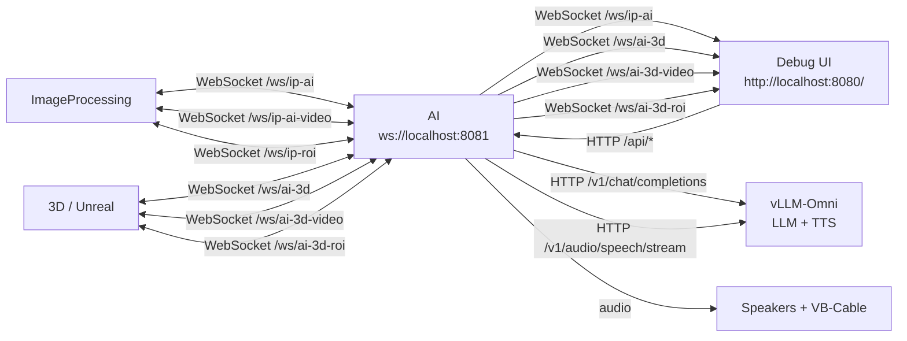

# The Witch

A digital installation featuring a virtual fortune teller that reads visitors' palms in real time using camera detection, AI analysis, text-to-speech, and a 3D animated fortune teller.

## Architecture



## Quick Start

Prerequisites: Python with `venv` support, camera/sensor access on the host, and a local or remote vLLM/vLLM-Omni install for LLM and TTS.

Run the full stack:

```bash
scripts/witch-compose up
```

The runner creates missing venvs and updates requirements automatically.

Run selected services by naming them:

```bash
scripts/witch-compose up ai ip
```

Open the debug UI:

```text
http://localhost:10030/
```

Run selected services:

```bash
scripts/witch-compose up ai
scripts/witch-compose up ip
scripts/witch-compose up ai ip
```

For a split setup, run `ai` on the desktop and `ip` on the Jetson or camera machine. Set `WITCH_AI_HOST` in `.env` on the camera machine to the desktop address.

```bash
scripts/witch-compose up ip
```

## Services

- `vllm`: external vLLM-Omni process serving LLM and TTS models
- `ai`: state machine, LLM/TTS orchestration, WebSocket API, debug UI
- `ip`: camera, hand tracking, palm ROI, and seat sensor client

## Configure

`.env` is the shared configuration file. Local Python loads it with `python-dotenv`; `scripts/witch-compose` also injects it into child processes.

For an all-local run on one machine:

```dotenv
WITCH_LLM_HOST=localhost
WITCH_TTS_HOST=localhost
WITCH_AI_HOST=localhost
```

For mixed machines, Jetson, or LAN setups, use an address reachable from every service that needs it:

```dotenv
WITCH_LLM_HOST=192.168.1.20
WITCH_TTS_HOST=192.168.1.21
WITCH_AI_HOST=192.168.1.10
```

The app derives service URLs from those host and port values:

```dotenv
LLM: http://${WITCH_LLM_HOST}:${WITCH_LLM_PORT}
TTS: http://${WITCH_TTS_HOST}:${WITCH_TTS_PORT}
AI: ws://${WITCH_AI_HOST}:${WITCH_AI_PORT}
```

Do not use `localhost` for cross-machine connections. Use the LAN address of the machine running that service.

### Local Audio

The AI plays TTS audio directly to VB-Cable (for Unreal) and default speakers.

For Windows/Mac: download https://vb-audio.com/Cable/ and restart device

For Linux:
```bash
pactl load-module module-null-sink sink_name=WitchVirtualCable sink_properties=device.description=WitchVirtualCable
```

Audio plays automatically via sounddevice.


## Local Python

Prerequisites:

- vLLM-Omni installed locally so the `vllm` command is on `PATH`
- Camera and sensor access configured for the host machine
- `.env` hosts set to values reachable by the local services, usually `localhost` for an all-local run

Create the venvs once:

All platforms:

```bash
scripts/witch-compose build ai ip
```

Manual Linux setup:

```bash
python3.13 -m venv ArtificialIntelligence/.venv
ArtificialIntelligence/.venv/bin/pip install -r ArtificialIntelligence/requirements.txt

python3.13 -m venv ImageProcessing/.venv
ImageProcessing/.venv/bin/pip install -r ImageProcessing/requirements.txt
```

Windows PowerShell:

```powershell
py -3.13 -m venv ArtificialIntelligence\.venv
ArtificialIntelligence\.venv\Scripts\pip install -r ArtificialIntelligence\requirements.txt

py -3.13 -m venv ImageProcessing\.venv
ImageProcessing\.venv\Scripts\pip install -r ImageProcessing\requirements.txt
```

Start the services together:

```bash
scripts/witch-compose up
```

Or start them in separate terminals:

Linux:

`vllm` (LLM + TTS):

```bash
scripts/run_server.sh
```

`ai`:

```bash
source ArtificialIntelligence/.venv/bin/activate
python -m ArtificialIntelligence.main
```

`ip`:

```bash
source ImageProcessing/.venv/bin/activate
python -m ImageProcessing.main
```

Windows PowerShell:

`vllm` (LLM + TTS):

```powershell
bash scripts/run_server.sh
```

`ai`:

```powershell
ArtificialIntelligence\.venv\Scripts\Activate.ps1
python -m ArtificialIntelligence.main
```

`ip`:

```powershell
ImageProcessing\.venv\Scripts\Activate.ps1
python -m ImageProcessing.main
```

The `scripts/run_server.sh` script starts the local LLM and TTS model servers, and stops both child processes when interrupted.

## Seat Sensor

The `ip` service publishes a `person_detected` event when the VL53L0X seat sensor detects someone sitting down. For local testing without sensor hardware:

```dotenv
WITCH_SEAT_SENSOR_OVERRIDE=true
```

## Custom TTS Voice

Qwen3-TTS uses the built-in `vivian` CustomVoice speaker by default.

## Unreal Engine Connection

Audio goes to VB-Cable which Unreal can capture as input.

```text
# Same PC as AI, native Unreal:
ws://localhost:10031/ws/ai-3d

# Different PC:
ws://<AI-machine-LAN-IP>:10031/ws/ai-3d

# AI video and ROI streams:
ws://<AI-machine-LAN-IP>:10031/ws/ai-3d-video
ws://<AI-machine-LAN-IP>:10031/ws/ai-3d-roi
```

## Useful Commands

```bash
scripts/witch-compose up
scripts/witch-compose up ai
scripts/witch-compose up ip
scripts/witch-compose build
```
