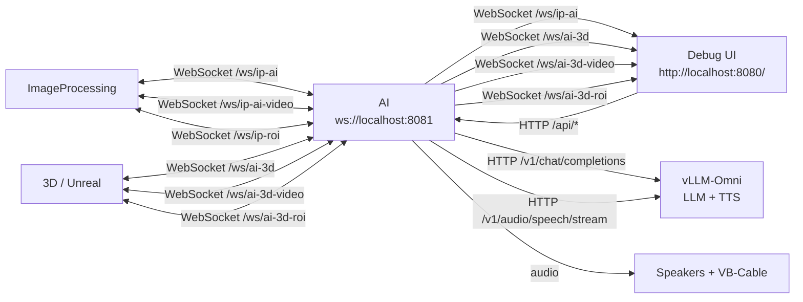

# The Witch

A digital installation featuring a virtual fortune teller that reads visitors' palms in real time using camera detection, AI analysis, text-to-speech, and a 3D animated fortune teller.

## Architecture



## Quick Start

Prerequisite: Podman with Compose support.

Run the full stack:

```bash
podman-compose up --build
```

`--build` belongs to the `up` command; `podman-compose --build` by itself is not a valid compose command.

Open the debug UI:

```text
http://localhost:10030/
```

Run selected services:

```bash
podman-compose up --build ai vllm
podman-compose up --build ip
podman-compose up --build ai vllm ip
```

For a desktop NVIDIA GPU or Podman host with NVIDIA CDI, use the GPU override when you also want GPU access for `vllm` and `ip`.

```bash
podman-compose -f compose.yaml -f compose.gpu.yaml up --build
```

For Jetson / Jetson Nano:

```bash
podman-compose -f compose.yaml -f compose.jetson.yaml up --build ip
```

For a split setup, run `ai` and `vllm` on the desktop or compute server:

```bash
podman-compose -f compose.yaml -f compose.gpu.yaml up --build ai vllm
```

Then run `ip` on the Jetson or camera machine:

```bash
podman-compose -f compose.yaml -f compose.jetson.yaml up --build ip
```

## Services

- `vllm`: vLLM-Omni serving LLM and TTS models
- `ai`: state machine, LLM/TTS orchestration, WebSocket API, debug UI
- `ip`: camera, hand tracking, palm ROI, and seat sensor client

## Configure

`.env` is the shared configuration file. Local Python loads it with `python-dotenv`; podman-compose injects it with `env_file`.

For an all-local run on one machine:

```dotenv
WITCH_LLM_HOST=localhost
WITCH_TTS_HOST=localhost
WITCH_AI_HOST=localhost
```

For Podman services that need to reach services on the Podman host:

```dotenv
WITCH_LLM_HOST=host.containers.internal
WITCH_TTS_HOST=host.containers.internal
WITCH_AI_HOST=host.containers.internal
```

For mixed machines, Jetson, or LAN setups, use an address reachable from every service that needs it:

```dotenv
WITCH_LLM_HOST=192.168.1.20
WITCH_TTS_HOST=192.168.1.21
WITCH_AI_HOST=192.168.1.10
```

The app derives service URLs from those host and port values:

```dotenv
LLM: http://${WITCH_LLM_HOST}:${WITCH_LLM_PORT}
TTS: http://${WITCH_TTS_HOST}:${WITCH_TTS_PORT}
AI: ws://${WITCH_AI_HOST}:${WITCH_AI_PORT}
Audio bridge: http://${WITCH_AUDIO_PLAY_HOST}:${WITCH_AUDIO_BRIDGE_PORT}
```

Do not use `localhost` for cross-machine connections. Inside a container it points back to that same container.

The `vllm` service builds `localhost/thewitch-vllm:latest` from the official `vllm/vllm-omni` image. The AI service connects to `WITCH_LLM_HOST:WITCH_LLM_PORT` and `WITCH_TTS_HOST:WITCH_TTS_PORT` over HTTP.

```bash
podman-compose up --build vllm
```

```dotenv
WITCH_TTS_VOICE=A female speaker speaking German. Natural prosody, realistic, not theatrical.
```

### Windows Camera

Podman Desktop for Windows runs Linux containers inside WSL2 and cannot pass the Windows webcam into the `ip` container. Keep a host-side webcam bridge running on Windows.

Create the venv and start the bridge:

```powershell
python -m venv ImageProcessing\.venv
ImageProcessing\.venv\Scripts\pip install -r ImageProcessing\requirements.txt
ImageProcessing\.venv\Scripts\python ImageProcessing\webcam_bridge.py
```

Optional camera selection:

```powershell
python ImageProcessing/webcam_bridge.py --list
python ImageProcessing/webcam_bridge.py --camera 1
```

### Audio Bridge

The AI plays TTS audio directly to VB-Cable (for Unreal) and default speakers.

**Local Python (Linux/Mac/Windows):**

For Windows/Mac: download https://vb-audio.com/Cable/ and restart device

For Linux:
```bash
pactl load-module module-null-sink sink_name=WitchVirtualCable sink_properties=device.description=WitchVirtualCable
```

Audio plays automatically via sounddevice - no bridge needed.

**Container on Windows with Podman:**

On Windows host, start audio bridge:
```powershell
python ArtificialIntelligence\audio_bridge.py
```

In `.env`, tell AI to use HTTP audio:
```dotenv
WITCH_AUDIO_PLAY_HOST=host.docker.internal
WITCH_AUDIO_BRIDGE_PORT=10034
```


## Local Python

Prerequisites:

- vLLM-Omni installed locally so the `vllm` command is on `PATH`
- Camera and sensor access configured for the host machine
- `.env` hosts set to values reachable by the local services, usually `localhost` for an all-local run

Create the venvs once:

Linux:

```bash
python3.13 -m venv ArtificialIntelligence/.venv
ArtificialIntelligence/.venv/bin/pip install -r ArtificialIntelligence/requirements.txt

python3.13 -m venv ImageProcessing/.venv
ImageProcessing/.venv/bin/pip install -r ImageProcessing/requirements.txt
```

Windows PowerShell:

```powershell
py -3.13 -m venv ArtificialIntelligence\.venv
ArtificialIntelligence\.venv\Scripts\pip install -r ArtificialIntelligence\requirements.txt

py -3.13 -m venv ImageProcessing\.venv
ImageProcessing\.venv\Scripts\pip install -r ImageProcessing\requirements.txt
```

Start the services in separate terminals:

Linux:

`vllm` (LLM + TTS):

```bash
source ArtificialIntelligence/.venv/bin/activate
python ArtificialIntelligence/servers/main.py
```

`ai`:

```bash
source ArtificialIntelligence/.venv/bin/activate
python -m ArtificialIntelligence.main
```

`ip`:

```bash
source ImageProcessing/.venv/bin/activate
python -m ImageProcessing.main
```

Windows PowerShell:

`vllm` (LLM + TTS):

```powershell
ArtificialIntelligence\.venv\Scripts\Activate.ps1
python ArtificialIntelligence\servers\main.py
```

`ai`:

```powershell
ArtificialIntelligence\.venv\Scripts\Activate.ps1
python -m ArtificialIntelligence.main
```

`ip`:

```powershell
ImageProcessing\.venv\Scripts\Activate.ps1
python -m ImageProcessing.main
```

The `run_vllm.py` script starts vLLM-Omni serving both LLM and TTS models.

## Seat Sensor

The `ip` service publishes a `person_detected` event when the VL53L0X seat sensor detects someone sitting down. For local testing without sensor hardware:

```dotenv
WITCH_SEAT_SENSOR_OVERRIDE=true
```

## Custom TTS Voice

Set `WITCH_TTS_VOICE` in `.env` to the Qwen3-TTS voice-design instruction you want to use.

## Unreal Engine Connection

Audio goes to VB-Cable which Unreal can capture as input.

```text
# Same PC as AI, native Unreal:
ws://localhost:10031/ws/ai-3d

# Different PC:
ws://<AI-machine-LAN-IP>:10031/ws/ai-3d

# AI video and ROI streams:
ws://<AI-machine-LAN-IP>:10031/ws/ai-3d-video
ws://<AI-machine-LAN-IP>:10031/ws/ai-3d-roi
```

## Useful Commands

```bash
podman-compose logs -f
podman-compose logs -f ai
podman-compose -f compose.yaml -f compose.gpu.yaml logs -f vllm
podman-compose stop
podman-compose down
```
