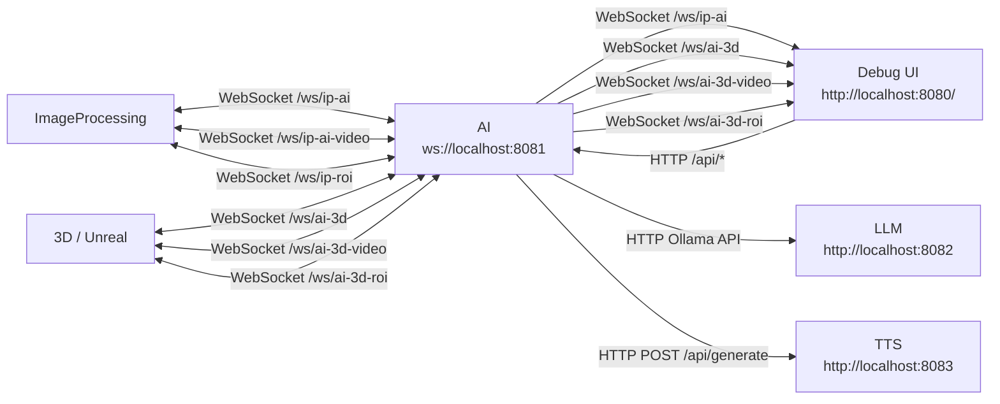

# The Witch

A digital installation featuring a virtual fortune teller that reads visitors' palms in real time using camera detection, AI analysis, text-to-speech, and a 3D animated fortune teller.

## Architecture



## Quick Start

Prerequisite: Podman with Compose support.

Run the full stack:

```bash
podman-compose up --build
```

Open the debug UI:

```text
http://localhost:10030/
```

Run selected services:

```bash
podman-compose up --build ai llm tts
podman-compose up --build ip
podman-compose up --build ai ip
```

For a desktop NVIDIA GPU or Podman host with NVIDIA CDI:

```bash
podman-compose -f compose.yaml -f compose.gpu.yaml up --build
```

For Jetson / Jetson Nano:

```bash
podman-compose -f compose.yaml -f compose.jetson.yaml up --build ip
```

For a split setup, run `ai`, `llm`, and `tts` on the desktop or compute server:

```bash
podman-compose -f compose.yaml -f compose.gpu.yaml up --build ai llm tts
```

Then run `ip` on the Jetson or camera machine:

```bash
podman-compose -f compose.yaml -f compose.jetson.yaml up --build ip
```

## Services

- `llm`: Ollama model server
- `tts`: text-to-speech API
- `ai`: state machine, LLM/TTS orchestration, WebSocket API, debug UI
- `ip`: camera, hand tracking, palm ROI, and seat sensor client

## Configure

`.env` is the shared configuration file. Local Python loads it with `python-dotenv`; podman-compose injects it with `env_file`.

For an all-local run on one machine:

```dotenv
WITCH_LLM_HOST=localhost
WITCH_TTS_HOST=localhost
WITCH_AI_HOST=localhost
```

For Podman services that need to reach services on the Podman host:

```dotenv
WITCH_LLM_HOST=host.containers.internal
WITCH_TTS_HOST=host.containers.internal
WITCH_AI_HOST=host.containers.internal
```

For mixed machines, Jetson, or LAN setups, use an address reachable from every service that needs it:

```dotenv
WITCH_LLM_HOST=192.168.1.20
WITCH_TTS_HOST=192.168.1.21
WITCH_AI_HOST=192.168.1.10
```

The app derives service URLs from those host and port values:

```dotenv
LLM: http://${WITCH_LLM_HOST}:${WITCH_LLM_PORT}
TTS: http://${WITCH_TTS_HOST}:${WITCH_TTS_PORT}
AI: ws://${WITCH_AI_HOST}:${WITCH_AI_PORT}
```

Do not use `localhost` for cross-machine connections. Inside a container it points back to that same container.

### Windows Camera

Podman Desktop for Windows runs Linux containers inside WSL2 and cannot pass the Windows webcam into the `ip` container. Keep a host-side webcam bridge running on Windows.

Create the venv and start the bridge:

```powershell
python -m venv ImageProcessing\.venv
ImageProcessing\.venv\Scripts\pip install -r ImageProcessing\requirements.txt
ImageProcessing\.venv\Scripts\python ImageProcessing\webcam_bridge.py
```

Optional camera selection:

```powershell
python ImageProcessing/webcam_bridge.py --list
python ImageProcessing/webcam_bridge.py --camera 1
```

### Audio Bridge

For Windows/Mac: first download https://vb-audio.com/Cable/ afterwards you'll have to restart your device once

For Linux: instead run the following command 

```bash
pactl load-module module-null-sink sink_name=WitchVirtualCable sink_properties=device.description=WitchVirtualCable
```

Afterwards create venv and start the bridge:

```powershell
python -m venv ArtificialIntelligence\.venv
ArtificialIntelligence\.venv\Scripts\pip install -r ArtificialIntelligence\requirements.txt
ArtificialIntelligence\.venv\Scripts\python ArtificialIntelligence\audio_bridge.py
```


## Local Python

Prerequisites:

- Python 3.11+
- Ollama installed and available as `ollama` on `PATH`, or `OLLAMA_BINARY` set to the Ollama executable path
- Camera and sensor access configured for the host machine
- `.env` hosts set to values reachable by the local services, usually `localhost` for an all-local run

Create the venvs once:

Linux:

```bash
python3 -m venv ArtificialIntelligence/.venv
ArtificialIntelligence/.venv/bin/pip install -r ArtificialIntelligence/requirements.txt

python3 -m venv ArtificialIntelligence/servers/llm_server/.venv
ArtificialIntelligence/servers/llm_server/.venv/bin/pip install -r ArtificialIntelligence/servers/llm_server/requirements.txt

python3 -m venv ArtificialIntelligence/servers/tts_server/.venv
ArtificialIntelligence/servers/tts_server/.venv/bin/pip install -r ArtificialIntelligence/servers/tts_server/requirements.txt

python3 -m venv ImageProcessing/.venv
ImageProcessing/.venv/bin/pip install -r ImageProcessing/requirements.txt
```

Windows PowerShell:

```powershell
py -3.11 -m venv ArtificialIntelligence\.venv
ArtificialIntelligence\.venv\Scripts\pip install -r ArtificialIntelligence\requirements.txt

py -3.11 -m venv ArtificialIntelligence\servers\llm_server\.venv
ArtificialIntelligence\servers\llm_server\.venv\Scripts\pip install -r ArtificialIntelligence\servers\llm_server\requirements.txt

py -3.11 -m venv ArtificialIntelligence\servers\tts_server\.venv
ArtificialIntelligence\servers\tts_server\.venv\Scripts\pip install -r ArtificialIntelligence\servers\tts_server\requirements.txt

py -3.11 -m venv ImageProcessing\.venv
ImageProcessing\.venv\Scripts\pip install -r ImageProcessing\requirements.txt
```

Start the services in separate terminals:

Linux:

`llm`:

```bash
source ArtificialIntelligence/servers/llm_server/.venv/bin/activate
python ArtificialIntelligence/servers/llm_server/main.py
```

`tts`:

```bash
source ArtificialIntelligence/servers/tts_server/.venv/bin/activate
python ArtificialIntelligence/servers/tts_server/main.py
```

`ai`:

```bash
source ArtificialIntelligence/.venv/bin/activate
python -m ArtificialIntelligence.main
```

`ip`:

```bash
source ImageProcessing/.venv/bin/activate
python -m ImageProcessing.main
```

Windows PowerShell:

`llm`:

```powershell
ArtificialIntelligence\servers\llm_server\.venv\Scripts\Activate.ps1
python ArtificialIntelligence\servers\llm_server\main.py
```

`tts`:

```powershell
ArtificialIntelligence\servers\tts_server\.venv\Scripts\Activate.ps1
python ArtificialIntelligence\servers\tts_server\main.py
```

`ai`:

```powershell
ArtificialIntelligence\.venv\Scripts\Activate.ps1
python -m ArtificialIntelligence.main
```

`ip`:

```powershell
ImageProcessing\.venv\Scripts\Activate.ps1
python -m ImageProcessing.main
```

The `llm` launcher starts the installed Ollama executable on `WITCH_LLM_PORT` and pulls `WITCH_LLM_MODEL`.

## Seat Sensor

The `ip` service publishes a `person_detected` event when the VL53L0X seat sensor detects someone sitting down. For local testing without sensor hardware:

```dotenv
WITCH_SEAT_SENSOR_OVERRIDE=true
```

## Custom TTS Voice

```bash
cp your-voice.wav ArtificialIntelligence/assets/default.wav
```

If the file is missing, TTS uses the model default voice.

## Unreal Engine Connection

```text
# Same PC as AI, native Unreal:
ws://localhost:8081/ws/ai-3d

# Different PC:
ws://<AI-machine-LAN-IP>:8081/ws/ai-3d

# AI video and ROI streams:
ws://<AI-machine-LAN-IP>:8081/ws/ai-3d-video
ws://<AI-machine-LAN-IP>:8081/ws/ai-3d-roi
```

## Useful Commands

```bash
podman-compose logs -f
podman-compose logs -f ai
podman-compose stop
podman-compose down
```
