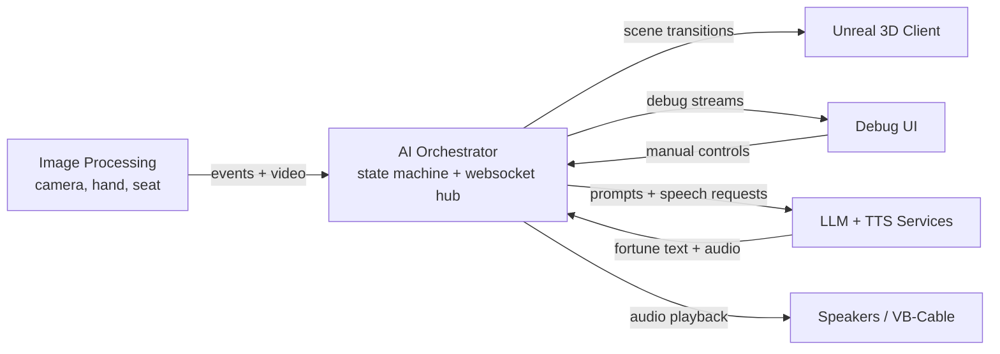

# The Witch

A digital installation featuring a virtual fortune teller that reads visitors' palms in real time using camera detection, AI analysis, text-to-speech, and a 3D animated fortune teller.

## Architecture



## Quick Start

## 1. Install Requirements (once)

```bash
https://docs.astral.sh/uv/getting-started/installation
```

## 2. Create the Docker connection (once)

```bash
docker context create my-compute-machine --docker "host=ssh://compassionate_mestorf@10.50.60.111"
```

## 3. Enter the Server Container

```bash
docker --context my-compute-machine exec -it compute_container_compassionate_mestorf /bin/bash
```

After joining the container, always do:

```bash
cd TheWitch
```

## 4. tmux Session (IMPORTANT)

We all use the SAME shared tmux session so the server processes stay alive even after closing the terminal.

### Create the session (if it does not exist)

```bash
tmux new -s thewitch
```

### Join the shared session

```bash
tmux attach -t thewitch
```

### See existing sessions

```bash
tmux ls
```

Inside tmux, anything you start keeps running after closing the window.

Use:

```bash
Ctrl + C
```

to stop running services.

## 5. Start the Server Services

Inside `TheWitch` folder:

```bash
./witch-compose llm tts
```

This starts:

- `llm` → Ollama server
- `tts` → vLLM-Omni server

These stay running inside tmux for everyone.

## 6. Run Local Services

On your own computer, only run:

### Mac/Linux

```bash
./witch-compose ai ip
```

### Windows (Terminal, NOT PowerShell)

```powershell
witch-compose.cmd ai ip
```

This starts:

- `ai` → orchestration/state machine
- `ip` → camera + hand tracking

## 7. `.env` Port Setup

```dotenv
# Other ports
WITCH_AI_UI_PORT=8080
WITCH_AI_PORT=8081

# Service ports
# Put these on local pc
#WITCH_LLM_PORT=33533
#WITCH_TTS_PORT=41333
# Put these on server
WITCH_LLM_PORT=10032
WITCH_TTS_PORT=10033
```

## 8. Webcam

In `.env`:

```dotenv
WITCH_CAMERA_SOURCE=0
```

- `0` → integrated webcam
- `1` → USB webcam

## 9. Unreal Engine Connection

Audio goes to VB-Cable which Unreal can capture as input.

```text
# Same PC as AI, native Unreal:
ws://localhost:8081/ws/ai-3d

# Different PC:
ws://<AI-machine-LAN-IP>:8081/ws/ai-3d
```

`/ws/ai-3d` carries `scene_command`, `analysis_started`, `analysis_result`, and `error` events.
Unreal can acknowledge the currently pending AI event with `{"type":"event_done"}`.

## Useful Commands

### Check GPU usage

```bash
nvidia-smi
```

Use this to see:

- which AI models are running
- GPU memory usage
- process IDs (PIDs)

This is useful if the GPU is full or old processes are still running.

### Stop a stuck process

```bash
kill <PID>
```

You get the PID from `nvidia-smi`.

### Local Audio

The AI plays TTS audio directly to VB-Cable (for Unreal) and default speakers.

For Windows/Mac: download https://vb-audio.com/Cable/ and restart device

For Linux with PipeWire/PulseAudio compatibility, create a persistent null sink:

```bash
./scripts/setup_linux_virtual_audio.sh
```

## Seat Sensor

The `ip` service publishes a `person_detected` event when the VL53L0X seat sensor detects someone sitting down. For local testing without sensor hardware:

```dotenv
WITCH_SEAT_SENSOR_OVERRIDE=true
```

## Custom TTS Voice

The public TTS endpoint accepts only the text input. Model selection, voice, language, fallback voice description, fixed reference text, and streaming settings are configured server-side in `.env`.

To prevent a broken model stream from blocking scene progression indefinitely,
the client terminates the upstream response after sustained near-silent output
following speech. Valid shorter pauses are buffered and played if speech resumes:

```dotenv
WITCH_TTS_SILENCE_STOP_SECONDS=5.0
```

The anchored Base voice is stored as an offline-precomputed ICL profile:

```bash
ArtificialIntelligence/servers/tts/custom_voices/witch.safetensors
```

At startup, the TTS host:

- Starts the Qwen3-TTS Base model on a private internal port.
- Loads the precomputed `witch` profile containing its speaker embedding and reference codec tokens.
- Exposes a text-only gateway on `WITCH_TTS_PORT`.
- Uses the stored voice for every request without loading or sending reference audio.

If no complete precomputed profile or reference recording exists, the host uses the VoiceDesign model with `WITCH_TTS_VOICE_DESCRIPTION`.

To create a new anchored voice, first stop the normal `tts` service and configure `WITCH_TTS_VOICE_DESCRIPTION` and `WITCH_TTS_ANCHOR_TEXT` in `.env`. VoiceDesign follows the speaking style and pace described by `WITCH_TTS_VOICE_DESCRIPTION`.

Generate the reference recording with VoiceDesign:

```bash
./witch-compose tts-design
```

This creates and validates:

```text
ArtificialIntelligence/servers/tts/custom_voices/voice_anchor.wav
```

Then start the normal TTS service:

```bash
./witch-compose tts
```

At startup, `tts` extracts the speaker embedding and reference codec tokens from the recording, writes `custom_voice_manifest.json` and `witch.safetensors`, and starts the anchored Base voice.
