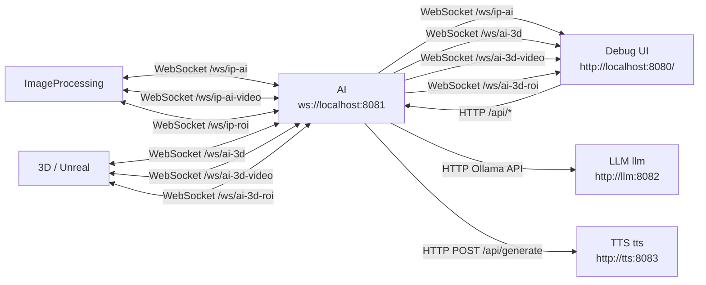

# The Witch

A digital installation featuring a virtual fortune teller that reads visitors' palms in real-time using camera detection, AI-powered analysis, text-to-speech, and a 3D animated fortune teller.

## Quick Start

Prerequisite: Docker Desktop installed

```bash
docker compose up --build
```

Debug UI: http://localhost:8080/

If the Docker host has NVIDIA container GPU support configured, use the GPU override:

```bash
docker compose -f compose.yaml -f compose.gpu.yaml up --build
```

On Windows, use the Windows commands below instead so the camera bridge is enabled.

## Architecture



## Configure

Default config (Docker service names) works for full local stack. If running services on other machines, update the `.env` hosts:

```dotenv
# LLM on another machine
WITCH_LLM_BASE_URL=http://192.168.1.20:8082

# TTS on another machine
WITCH_TTS_BASE_URL=http://192.168.1.21:8083

# ImageProcessing on Jetson -> AI on PC
WITCH_AI_BASE_URL=ws://192.168.1.10:8081
```

### Seat Sensor

The ImageProcessing service publishes a `person_detected` event when the VL53L0X seat sensor detects someone sitting down. For local testing without sensor hardware, override it so the person-present event is sent on startup:

```dotenv
WITCH_SEAT_SENSOR_OVERRIDE=true
```

## Running Specific Services

```bash
docker compose up --build ai llm tts
docker compose up --build ip
docker compose up --build ai ip
```

On Windows, start the webcam bridge first, then use the same `docker compose` commands.

## Jetson as Camera Client

1. On the AI machine: keep `ai` service running and reachable on port `8081`
2. On the Jetson: set `WITCH_AI_BASE_URL=ws://<AI-machine-LAN-IP>:8081` in `.env`
3. Run only the camera client:

```bash
docker compose up --build ip
```

## Windows

Docker Desktop for Windows cannot pass a webcam directly into the Linux `ip` container. Keep a small host-side webcam bridge running; the `ip` service will automatically fall back to it when direct camera access is unavailable.

1. In PowerShell, install the bridge dependencies once:

```powershell
pip install opencv-python websockets
```

2. Start the webcam bridge and leave this terminal open:

```powershell
python ImageProcessing/webcam_bridge.py
```

3. In a second PowerShell terminal, start the stack:

```powershell
docker compose up --build
```

If you have multiple cameras or a virtual camera, list available camera indexes and pass the one you want:

```powershell
python ImageProcessing/webcam_bridge.py --list
python ImageProcessing/webcam_bridge.py --camera 1
```

The bridge always listens on `8090`, and the container falls back to `http://host.docker.internal:8090/video`.

## Custom TTS Voice (Optional)

```bash
cp your-voice.wav ArtificialIntelligence/assets/default.wav
```

If the file is missing, TTS starts with the model default voice.

## Unreal Engine Connection

```
# From env: ${WITCH_AI_BASE_URL}/ws/ai-3d
# Resolved: ws://ai:8081/ws/ai-3d
```

## Useful Commands

```bash
docker compose logs -f        # All logs
docker compose logs -f ai     # AI logs only
docker compose stop           # Stop all
docker compose down           # Stop and remove containers
```
